# Decentralized Identity System

A self-sovereign identity management system built on Ethereum blockchain using Next.js and WebAuthn for biometric authentication.

## Description

This dApp enables users to create and manage their decentralized identities with complete control over their personal data. It leverages blockchain technology for data integrity and biometric authentication for enhanced security.

## Key Features

- **Self-Sovereign Identity Management**
  - Create and control your decentralized identity
  - Manage personal information (name, email, location)
  - Fine-grained consent management for data sharing

- **Biometric Authentication**
  - WebAuthn integration for secure authentication
  - Support for fingerprint and Face ID
  - Device-based authentication using secure enclave

- **Verifiable Credentials**
  - Issue and verify digital credentials
  - QR code-based verification system
  - Blockchain-backed trust and authenticity

- **Access Control & Monitoring**
  - Track identity access history
  - View detailed access logs
  - Etherscan integration for transaction verification

## Screenshots

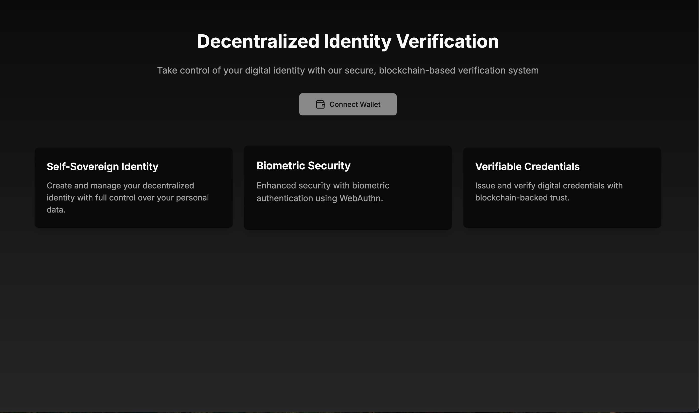
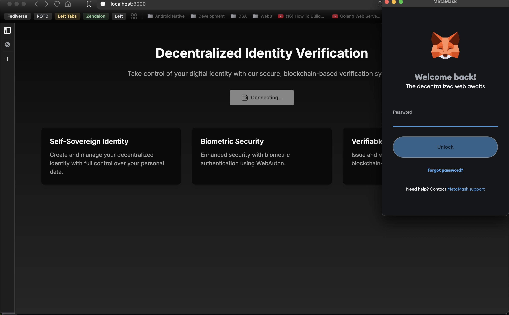
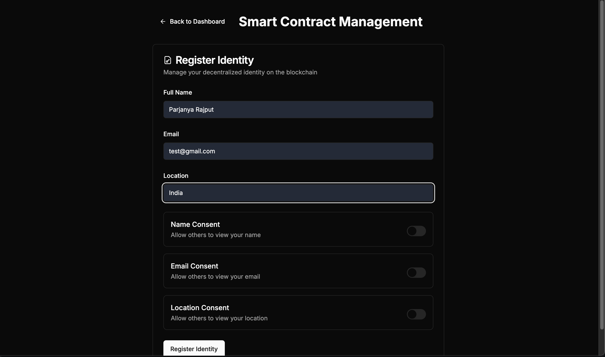

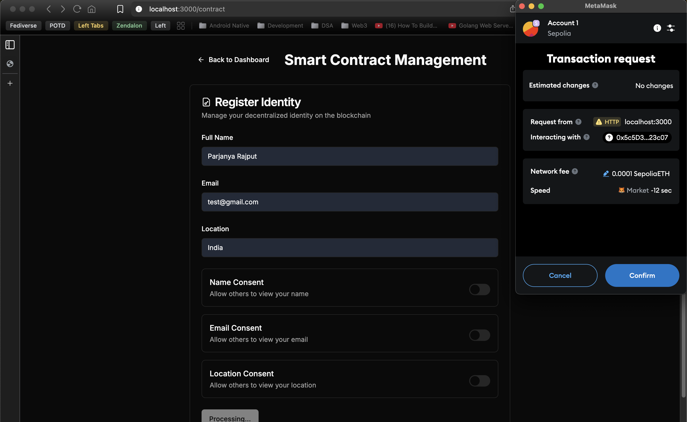
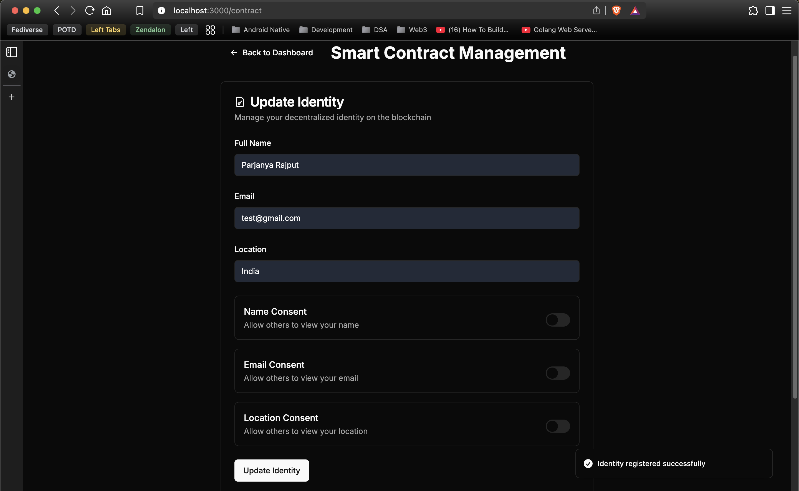


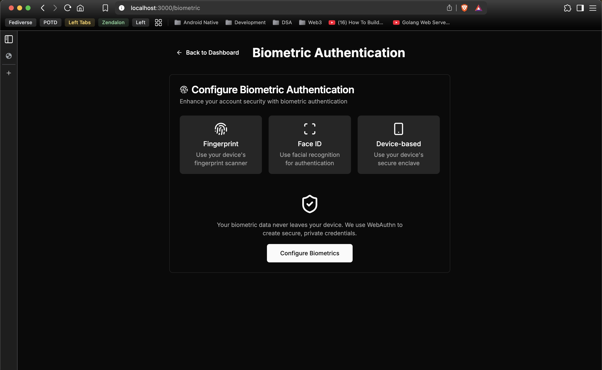

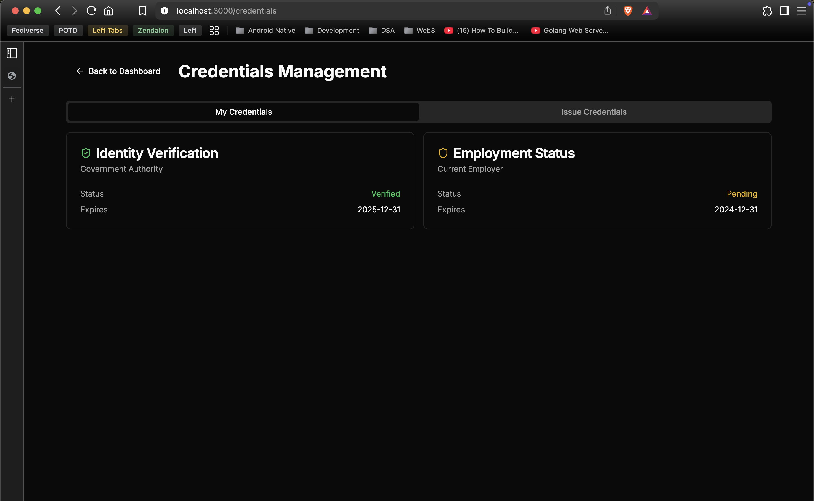

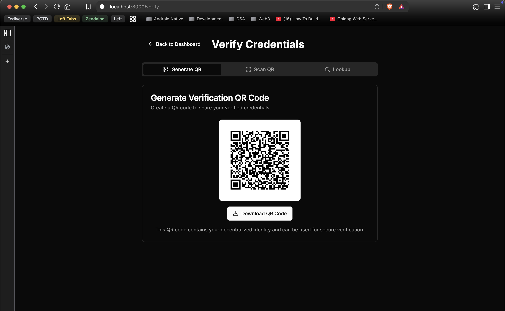
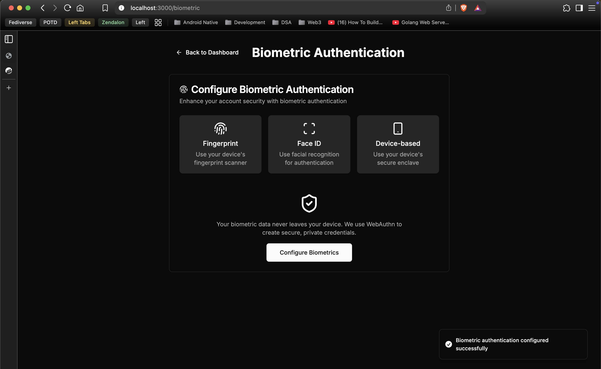
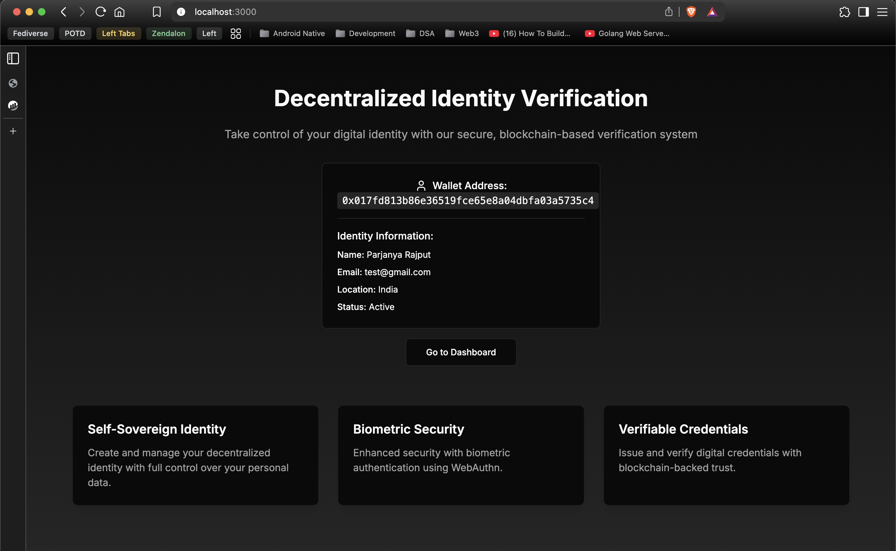

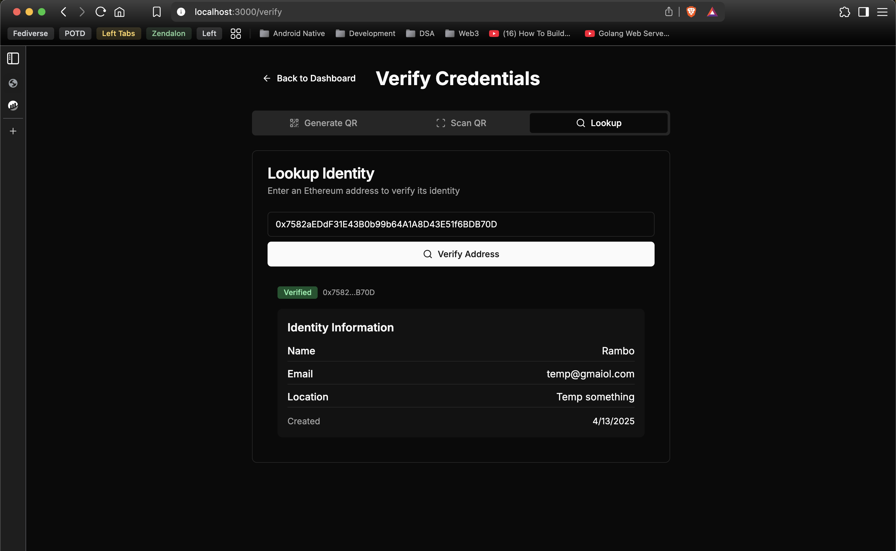
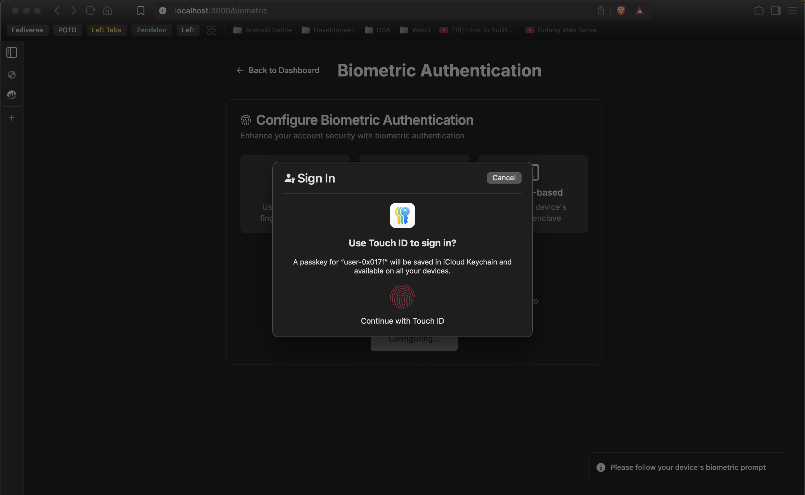

### Etherscan Integration
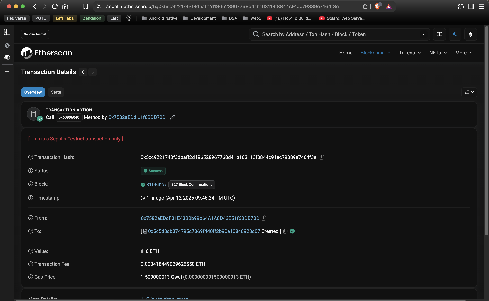
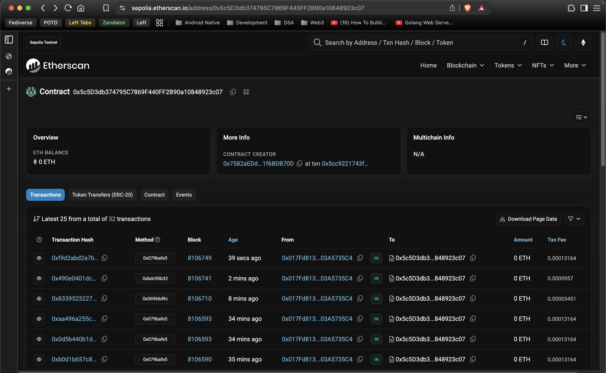

## Setup Instructions

1. Clone the repository:
```bash
git clone https://github.com/yourusername/decentralised_identity_system.git
cd decentralised_identity_system
```

2. Install Dependencies
```bash
pnpm install
```

3. Create .env file in root directory with:
```
NEXT_PUBLIC_DID_REGISTRY_ADDRESS=0x5c5D3db374795C7869F440FF2B90a10848923c07
```

4. Run the Development Server
``` pnpm run dev ```

## Technologies Used
- Next.js 13
- TypeScript
- Ethereum / Ethers.js
- WebAuthn
- Tailwind CSS
- Framer Motion
- Shadcn UI

## Network Information
This dApp is deployed on the Sepolia testnet. Make sure your wallet is configured to use the Sepolia network.

## License
MIT
